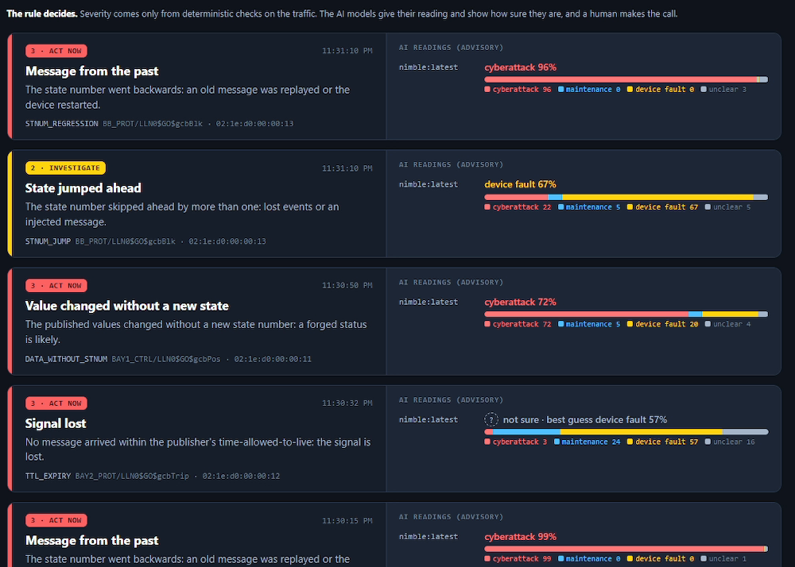

# GOOSE Watch

**The rule decides. The AI shows its doubt. A human makes the call.**

A passive monitor for IEC 61850 GOOSE traffic on a substation bus. Deterministic rules decide every alert and its severity. Local System One decision models (through Ollama's `/v1/systemone`) add an advisory reading with honest probabilities. The model adapter only talks to a loopback endpoint, so this tool sends no capture to a hosted model.

> **Status: lab-grade base, 2026-10-02.** Everything below runs on synthetic GOOSE traffic generated by this repository. It has **not** been run on a real substation bus. See *What is and is not measured*.



## How it works

```
mirror port / lab link ─▶ tshark (GOOSE decode) ─▶ rules (severity 1–3) ─▶ board
                                                         │
                                                         └▶ local model: cause + doubt (advisory only)
```

- **Rules** (`src/rules.ts`): new publisher (unknown control block or unexpected MAC), configuration change, stNum regression (replay or restart), stNum jump (poisoning), sqNum reset, value change without a new stNum, loss of signal (time-allowed-to-live), test flag, Ed2 simulation bit, malformed header. The baseline of publishers, and the largest time-allowed-to-live each one uses, is learned from a clean capture; silence is timed against that learned value, never a frame's own. After a regression the lower sequence is watched with every rule and replaces the old one only with restart evidence. A repeat folds into its open alert for at most a minute, a regression to a different stNum is always a new alert, and a flood of forged publishers stays bounded in memory, alerts and model calls.
- **Models** (`src/triage.ts`, `src/hops.ts`): the default pack 3 measures facts in code, asks the model which evidence pattern they match (or the cause, for classes the rule already explains), and maps the pattern to a cause (cyberattack / maintenance / device fault / unclear). Below p 0.60 the board says **not sure**. The model can never raise, lower or clear an alert.
- **Who looks** (`needsHuman()` in `src/triage.ts`): code decides. Severity 2 or 3, an unsure model, or a cyberattack reading means "a human checks now". The model's own needs-a-human answer is kept in reports only.
- **Board** (`src/board.ts`, `src/board.html`): a live page on `127.0.0.1:8099`.

## Quick start

You need Linux or WSL2, bun ≥ 1.4 and tshark ≥ 4.4. For the AI readings, add Ollama ≥ 0.35 with a decision model (`ollama pull nimble`).

```sh
bun install && bun test                    # 103 tests, tshark as the decoder oracle
bun src/cli.ts run --file fixtures/replay.pcap --baseline fixtures/baseline.json
scripts/demo.sh 2                          # isolated lab + live board on http://127.0.0.1:8099 ; scripts/demo.sh stop
```

**New here? Read [`docs/GETTING-STARTED.md`](docs/GETTING-STARTED.md).** It goes step by step from the first test to a live board with a local AI, then shows how to point the pattern at your own network and how to add a rule.

More commands:

```sh
bun src/cli.ts scenarios fixtures          # regenerate every synthetic pcap, byte for byte
scripts/watch-lab.sh 1                     # the lab as a tmux session: tmux -S /tmp/goosewatch.sock attach -r
bun src/eval.ts nimble:latest --gold gold/gold-v3.json --pack 3   # measure a model on the fixed gold set
```

The lab runs inside `unshare -rnm`: a private network namespace with one veth pair (`gwa` → `gwb`) and no uplink. Raw sockets refuse any interface that isn't a veth named `gw*`, and any namespace that contains another interface, so a macvlan, a VLAN or a renamed NIC is refused. What the far end of a veth is plugged into is outside the namespace's view: the lab scripts never bridge it, and `scripts/proxmox-lab.sh` refuses a `vmbr9` that has a port.

If `ollama pull` stalls (seen on WSL2), `scripts/fetch-model.sh <name> <tag> <dir>` mirrors the model with every layer sha256-verified. You then serve it with `OLLAMA_MODELS=<dir> ollama serve`.

## What is and is not measured

**Measured, on this repository's synthetic traffic only:**

- All 14 scenarios decode losslessly through tshark, and each raises exactly its expected alert set. The clean baseline and a held-out clean capture raise none.
- Removing any one rule makes its test fail (`scripts/mutate-rules.sh`, 10/10), and undoing any one hardening guard does too (`bun scripts/mutate-hardening.ts`, 22/22 named guards).
- Live capture through the isolated lab link raises the same alerts as the offline decode (`scripts/live-parity.sh`, 14/14 at 4x), with the same PDU timestamp ages (lab replay retimes each frame).
- Model evaluation on 39 held-out gold cases (gold-v3), with labels and stop rule fixed beforehand (`docs/EVAL.md`):

  | Model | Pack | Verdict | Not sure | Confident accuracy | Attacks caught | p50 |
  |---|---|---|---|---|---|---|
  | nimble (9B, GPU) | 1 | PASS | 8% | 0.92 | 60% | 545 ms |
  | nimble (9B, GPU) | 3 | PASS | 8% | 1.00 | 80% | 475 ms |
  | tev1 (4B, CPU) | 1 | STOP | 64% | 1.00 | 0% | 6.8 s |
  | tev1 (4B, CPU) | 3 | PASS | 26% | 1.00 | 73% | 1.6 s |

  On pack 1, nimble called every replay attack "device fault" at 81–85%. Pack 3 gets them right. Live, nimble still reads the poisoning jump as "device fault" at 0.67–0.68; the rule raises it at severity 2 and the board says a human checks now.

**Not measured:**

- Any real IED, real substation traffic, or real mirror port.
- PRP/HSR duplicate handling.
- Performance at bus scale. Live capture has no kernel capture filter yet (it could not be verified here), so tshark dissects every frame on the mirror port; on a bus that also carries Sampled Values, measure CPU before relying on it.
- Model behaviour outside these 11 synthetic evidence patterns.

The gold cases share one generator and are not independent field samples. Several alert classes nearly determine the label, so the eval mostly tests the two classes that need judgement: stNum regression and new publisher.

**Known limits.** GOOSE carries no authentication unless the site deploys IEC 62351-6, so every field in a frame, MAC included, can be forged. A passive monitor can make forgery loud; it cannot always make it impossible.

- A crafted restart: an attacker silences a relay for longer than its learned time-allowed-to-live, then sends frames with a fresh timestamp. That is exactly what a reboot looks like. It raises TTL_EXPIRY and STNUM_REGRESSION (both severity 3) and takes at least 10 s before the rules follow the new sequence.
- A forward forgery: a frame one state ahead with forged values is a normal state change. The real relay's next frame then reads as STNUM_REGRESSION (severity 3), which is the alarm, but the monitor cannot tell which of the two sources is genuine.
- Closing both needs authenticated GOOSE or a second, independent view of the same signal, for example the relay's own state read over MMS.
- A relay whose clock is more than 5 s behind (or 1 s ahead of) the sensor never shows restart evidence: after a reboot it keeps raising STNUM_REGRESSION until a person looks. A relay that keeps its stNum across a reboot shows as TTL_EXPIRY then SQNUM_RESET, and is followed normally after that. stNum and sqNum wrap-around at 2^32 is treated as a regression.
- The Ed2 `simulation` flag is read as the Ed1 test flag, and quality `test` bits and Beh/Mod are not read, so an Ed2 relay in test mode raises nothing by itself. The dataset is compared byte for byte, but its meaning (which member is which signal) needs the SCL/SCD import that is not built yet.
- Timing protections rely on a baseline learned by this version, which records each publisher's time-allowed-to-live; `run` warns when a baseline lacks it. Repeats of an open alert are printed at most every 10 s, a condition that keeps going (a silence included) is announced again each minute, and the board replays only the last 200 lines of the current run when it restarts.
- Sequence and value checks start from the first frame the monitor sees: there is no continuity across a monitor restart, and a forged first frame becomes the starting point. With `run --stdin`, silence is timed only once the first frame has arrived, and a capture piped in then held open reads as the publishers going silent.
- The board's "live" badge means the browser is connected to the board, not that the sensor is capturing: supervise the capture process separately. A GOOSE frame whose PDU carries none of the fields read here (a truncated frame, or a GSE management PDU) is reported as MALFORMED_PDU.

## Repository layout

| Path | What it holds |
|---|---|
| `src/` | decoder, rules, triage packs, board, lab socket, eval |
| `test/` | `bun test` suites, with tshark as the decoding oracle |
| `fixtures/` | synthetic pcaps, one per scenario, regenerated byte-for-byte by `bun run scenarios` |
| `gold/`, `reports/` | held-out gold sets and the eval report for every model × pack ([index](reports/README.md)) |
| `scripts/` | isolated lab, live parity, rule mutation, Proxmox lab, model mirror |
| `docs/` | [claims](docs/CLAIMS.md), [eval method](docs/EVAL.md), [pattern](docs/PATTERN.md), [getting started](docs/GETTING-STARTED.md) |
| `examples/home-watch/` | the same pattern for a home or small-office network |

Every test and script cites the claim it guards (`C5`, `A2`, …). [`docs/CLAIMS.md`](docs/CLAIMS.md) lists them all, each with the probe that would prove it false.

## Use the pattern elsewhere

- `docs/PATTERN.md`: rules, doubt, human, for any monitoring job, with examples for homes, offices, smart homes and solar.
- `examples/home-watch/`: the pattern for a home or small-office network in one file (ARP: new device, network scan, fake router). `bun examples/home-watch/home.ts demo` runs it with no network access.

## Safety

The monitor is passive. The lab tools that send frames refuse to run outside an isolated namespace. Read [`SECURITY.md`](SECURITY.md) before you connect anything to a real bus.

## Licence

MIT, see [`LICENSE`](LICENSE).
